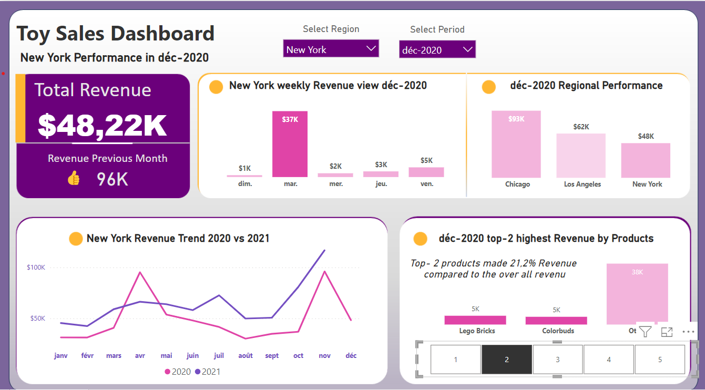

# toy-sales-insights

### 1 - Dasboard Overview

- Satic

- In action:

### 2- Description

This repository contains a guided project from [Data and Decision youtube's channel](https://m.youtube.com/watch?v=7EEGhZb2WKY) where I built a **Toys Sales Insights Report** using **Power BI**. The analysis is conducted using a real dataset with more than `6000` sales records from different stores in differnt regions in the US. This report focuses on **Revenue Generated** accross all stores and cities.  `key metrics` presented are as follow:

- Revenue trend on a monthly basics,
- Revenue comparison across sales region
- Top N highest revenue by products (to see which products are doing well as compared to the overall revenue)

---> `Credit:` [Data and Decision](https://m.youtube.com/@datalab365)

### 3- Key Takeaways

Working on this guided project, I

Throughout the guided project, I delved into a set of essential Power BI features and analytical methods that enriched my skill set. These include:

- checking column qualities
- remove duplicates
- split dataset into differents table
- creating new table using DAX Querries
- sort  a column based on the value of another column
- create column by combining value from two or more columns
- use of functions like : T**OPN, SELECTED, SELECTEDVALUE, ALLSELECTED, and RANKX**. 
- creation and usage of **VARIABLES**
- Template customization

